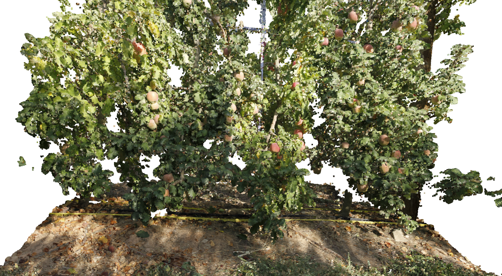
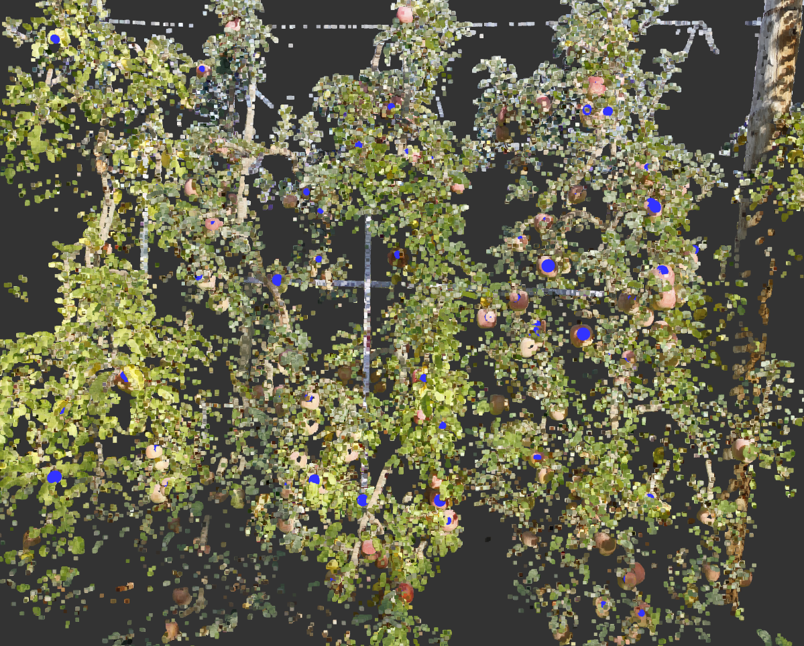
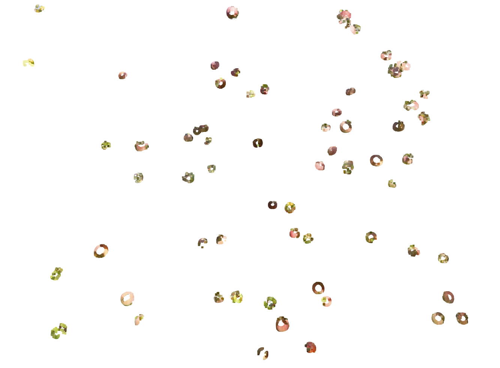

# Multiple 3d Apples Detection/Segmentation from a 3d Point Cloud

## Introduction

This project includes python code to detect and segment apples from a point cloud of apple trees.

The problem is addressed in two main steps, color clustering and sphere fitting. In the first main step, the points
were clustered by color with the clustering algorithm DBSCAN to extract the inliers, the apple points from the
outliers, the tree points. In the second main step, the script fit multiple 3d spheres to the extracted points by the
RANSAC algorithm. The apples are assumed to spheres with size between 0.06 and 0.10 m. Therefore, their rhos range
from 0.03 to 0.05 m.

## Methods

Important files in this project are:
1) main.py
2) point_cloud_to_3d_image.py
3) requirements.txt
4) tools.py

The main.py file is the main script to run. This uses the several functions which are defined in tools.py to
preprocess the data, to segment and localise the apples. At the end, main.py saves in ./results the segmented
apple points and the fitted sphere parameters which are the center coordinates and the rhos.

The scrip point_cloud_to_3d_image.py a user-friendly tool to explore the 3d datapoints by showing the 3d image in
slices of 2d images. You need to press the keys UP and DOWN to change displaying 2d slide. 

## Setup

- I recommend to use 32 GB of memory or more to run these scripts

- Install all python packages that are in the requirements.txt. The packages include
  [CalaPy](https://pypi.org/project/calapy) which is my own library that contains a collection of functions that
  I tend to use in different projects. Make sure you use the version 0.1.15.6 or older

- save the files "dataset/apple_trees.txt" and "dataset/some_apples/2018_01_*.txt"
  in the same root directory of main.py "./". These files were too big to be uploaded to this github repository.
  If needed, contact me.  

## Results

These methods found 68 apples in less than 4 minutes (in my local machine which is slow), including some false
positives. There were also some false negatives.

The picture below shows the apple trees without the segmented apples and these were replace by the found spheres
(in blue).

Instead, the following picture displays the segmented apples by the method.

The two images show that the apples were accurately detected and segmented. Yet, the performance was not perfect
since there were some false positives and some false negatives. For instance, the darker apples in the shadows
were filtered out (false negatives). These issues may be solved by tuning the illumination of the colored points.  
